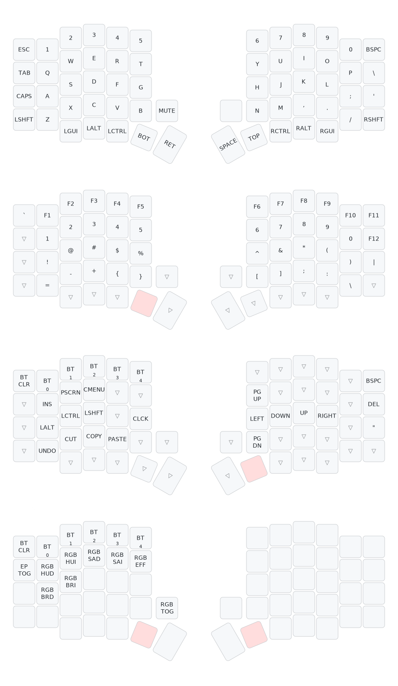

# zmk-config
|  |  |
|--|--|
| ZMK | https://zmk.dev/docs/user-setup |
| Web editor | https://nickcoutsos.github.io/keymap-editor/ |
| Keymap drawer | https://github.com/caksoylar/keymap-drawer   https://keymap-drawer.streamlit.app/|
  
 
## Sofle

**bootloader mode**:  press twice the reset button 
**pair both halves**: press the reset button once on both halves at the same time

